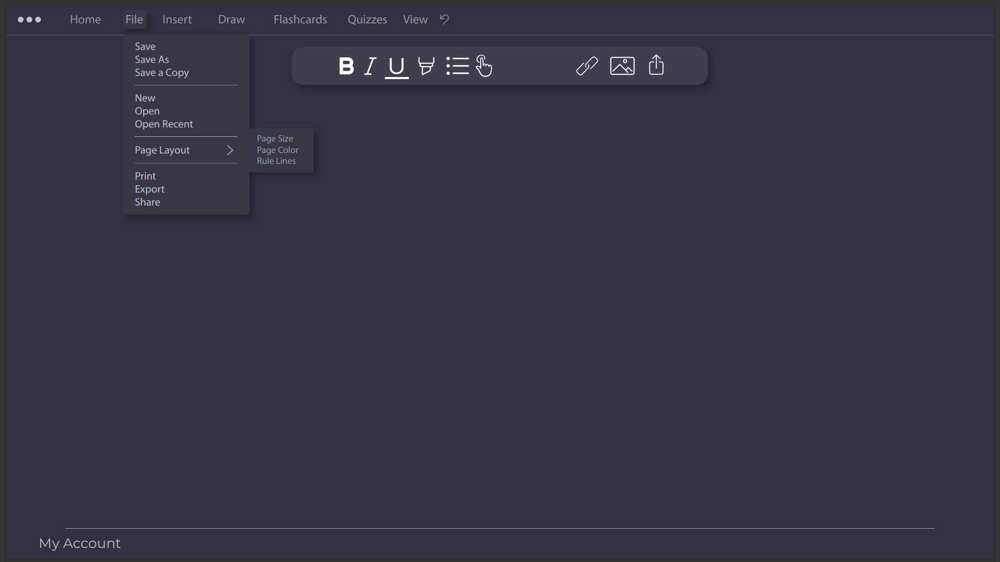
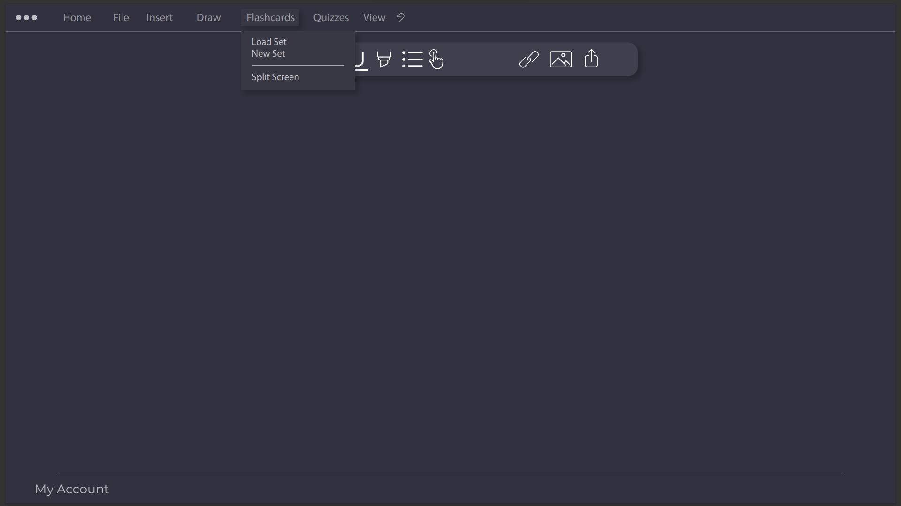
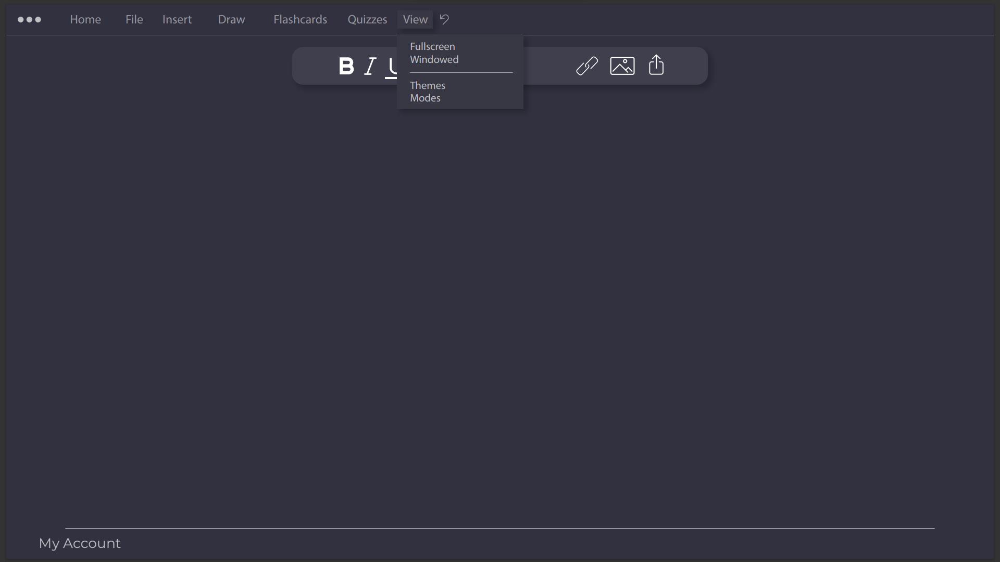

# Project N by MMM

## Team and Project Name

### Project name:

Project N

### Our team’s name:

MMM

### Our team members:

Yulia Anna Bobkova

Saksham Singh Sohal

Santiago Daza

Vladimir Zhelev

### Primary contact:

Yulia Anna Bobkova yulia.anna.bobkova@gmail.com

## Product Overview:

### Purpose:

Our objective is to design and develop a simple web note-taking application that stands apart by weaving in knowledge-testing functionalities. This primary feature is designed to not only aid in the retention of information, but also to improve the quality of life for its users by offering a dual-purpose tool-note-taking and knowledge testing in one cohesive environment.

### Target Audience:

- Primary: Students across various educational levels.

- Secondary: Professionals and individuals seeking an organized way to document information and test their retention.

### Rationale for Target Audience Selection:

Drawing from our personal experiences as university students, we have navigated the landscape of various note-taking apps. This firsthand experience provides us with unique insights into the shortcomings and potential improvements over existing solutions. By addressing these gaps, we believe our application will resonate well with our peers and beyond.

### Scope of the Product:

The application will offer the basic functionalities of a note-taking app combined with the ability to create quizzes or knowledge tests based on the notes. Additional features like cloud syncing, collaborative note-sharing, and integration with other educational tools will be explored in the subsequent phases.

### Key Features:

- Intuitive note-taking interface.

- Knowledge-testing tools integrated within the app.

- Customizable note templates for different types of content.

- Multi-device syncing capability.

- Offline accessibility.

- Search and indexing for quick retrieval of notes.

### Planned Operating Environments/Platforms:

Our initial release will be a Web App, then it will target iOS and Windows operating systems, capitalizing on the vast mobile user base. Subsequent phases will embrace web browsers, supported by essential backend systems, frontend frameworks, and robust databases, ensuring seamless transitions and consistent user experience across all platforms.

## Product Features

ProjectN purpose is to provide a comfortable note-taking environment for the user with a variety of customization and quality-of-life features.

Its layout is intended to be clean and easy on the eyes, with the default colour scheme limiting the amount of light emitted from the screen. Included are two taskbars, both of which have a manipulable position; the top task bar, which will include basic features to manipulate the text, such as font size, style, colour, as well as the option to insert an image or URL, as well as the left taskbar, the purpose of which will be opening files, saving files, and accessing the program’s customizable settings. These taskbars will be collapsible if the user so wishes.

### Formatting

The main formatting for the text is going to follow the guidelines of Markdown Formatting. This is a key feature since we want to give the user control over their files and not having to depend on a particular proprietary format to handle their files. The syntax for it will follow the [Markdown Basic Syntax](https://www.markdownguide.org/basic-syntax/) at its core.

For further format layering, ProjectN is going to follow a similar process to other note-taking application. Since Markdown is the bare minimum formatting, further tools could be developed adding formatting elements from plain text. For example: ==text== would render a highlighted text.

Moreover, for intermediate users, a variety of keyboard shortcuts to ease the user experience are provided. Listed below are the provided shortcuts:

| Functionality | Shortcut       |
| ------------- | -------------- |
| Change View   | Ctrl + Alt + S |
| Code block    | Ctrl + Alt + C |
| Copy          | Ctrl + C       |
| Cut           | Ctrl + X       |
| Paste         | Ctrl + V       |
| Redo          | Ctrl + Y       |
| Select All    | Ctrl + A       |
| Undo          | Ctrl + Z       |
| Search        | Ctrl + F       |
| Save          | Ctrl + S       |
| Bold          | Ctrl + B       |
| Italic        | Ctrl + I       |
| Underline     | Ctrl + U       |
| Highlight     | Ctrl + H       |
| H1            | Ctrl + 1       |
| H2            | Ctrl + 2       |
| H3            | Ctrl + 3       |
| H4            | Ctrl + 4       |
| H5            | Ctrl + 5       |
| H6            | Ctrl + 6       |

For beginners, the application is going to have a hovering tools bar that is going to allow the user to select different formatting options. Once the user hoovers over one, it will display the shortcut.

### Colour Standards

Dark mode is going to be default and the possibility to change to light mode for accessibility purposes.

|Feature|Colour|
|---|---|
|Background colour|#31313f|
|Default collapsible menu|#3f3f4e|
|Text and icons|#00000|
|Top bars drop|#383845|

### Quiz

The user will be able to enter quiz mode. Where they will be able to create questions based on the notes they are taking with different options like, multiple choice questions, short answers, and long answers.

### PDF Linking

We want the user to be able to link the notes they are taking with slides. The user can see side by side the presentation and the notes that are being taken.

### Flashcards

ProjectN is going to have a feature to help users create flashcards as a memorization tool. This feature will let users make multiple sets of flashcards, with each one having information on both sides, which can be accessed by either clicking on them or using the flip button.

Finally, the application will include a flashcard feature like that of other memorization programs. This will assist the user in the sense that our application can serve as an “all-in-one", eliminating the need for external applications.

## User interfaces

The sketch depicts the landing point for the users when they first open the app. It will let them choose the between their pinned notes, the most recent they have worked on, or create a new one. It also has a file tree for them to navigate through other files. It also will present the opportunity to change the settings for the app.

Features: This is the main workspace in the application. It has a collapsible sidebar that gives you access to your files. Also, there is a hovering toolbar to help with basic text formatting, accessing touch mode, and inserting external files. The top bar lets you access other features like, flashcards, quizzes, etc.

Features: This is the file dropdown menu which has many standard file options as shown. Page layout will let the user decide the paper size, colour or lines that are suitable for their needs. Customizability options like these are a priority for our application.

Features: The insert dropdown menu allows the user to use this app for more than just the plain text document features. Inserting a file or an image connects the user to what they are learning and

Features: This is the first sketch for Flashcard drop down menu. It will allow the user to create a new flash card set and, if wanted, to visualize it on a split scpepareen.

Features: This is the first sketch for Quiz drop down menu. It will allow the user to create a new quiz set and, if wanted, to visualize it on a split screen.

Features: The view dropdown menu allows user to switch between Full-screen and windowed mode. It also gives users the option to choose between different themes for the application that the user can create and access different typing modes like, Zen mode, focus mode, etc.

## Key Use Cases/Scenarios (all)

John is a 24 years old political Science student. He is required to take several notes on his classes. Usually, in his classes, the professor shares the slides on the student’s portal. He wants to take notes as the class goes through, he wants to annotate.

Bob wants to jot down key points from a book, emphasizing important terms, Bob starts a new note. While writing, he uses bold for headings, italics for emphasis, and bullet points for a list of terms. He also highlights a critical point in yellow to revisit later. (Case for special features).

Lily is a university student who's just wrapped up a lecture on Quantum Physics. She wants to jot down some crucial points, test her understanding, and then review her notes later on her tablet.

Ella is travelling, but doesn't want to miss out on her study routine. She uses the app on different devices to ensure her study continues uninterrupted.

Jasmine is learning French and wants to utilize the app's knowledge-testing features to enhance her language skills. (Flashcard Creation for Language Learning)

Sophia has finals week approaching. She plans to use the application not just to take notes, but also to schedule knowledge tests at regular intervals to ensure retention and timely revisions. (Revision Week with Scheduled Knowledge Tests)

## Any Non-Functional requirements

### Hardware requirements:

- Processor (CPU): Dual-core or higher processor

- Memory: Minimum 2GB

- Storage: Minimum local storage is required for a web browser. 5GB is recommended.

- Graphics: A basic integrated graphics card required to run the browser.

- Internet: A connection to the internet.

These system requirements can effectively run all the basic functions of Project N. However, performance will depend on how many complex features are being used.

### Safety Requirements:  

To ensure, data-safety, the application has a bug report system set in place for users to report bugs and to help developers keep the web application updated with new patches.

### Security Requirements:  

ProjectN follows Advanced Encryption Standard (AES) for your data. There are proper authentication and authorization mechanisms set in place to protect user data.

### Software Quality Attributes:  

ProjectN provides a user-friendly experience with all kinds of simple and advanced features. It has an easy learning curve and allows an easy transition for users who have used othernote-taking applications.

## Final Notes