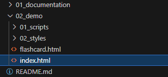
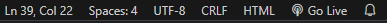

# User Manual

## How to use projectN

### Features
- Taking notes in extended markdown and saving them locally
- Opening markdown files from your local drive onto to the web-app
- Creating a set of flashcards
- Light mode and dark mode
- You can use basic formatting shortcuts
- Clean and uncluttered user interface

### Rules
- Standard markdown rules for formatting
- Character count must not exceed 500,000 characters
- Import files only in .md and .txt format
- Don't load images or videos onto the program

## How to Build it

- Install [VS Code](https://code.visualstudio.com/)
- Install [Live Server Extension](https://marketplace.visualstudio.com/items?itemName=ritwickdey.LiveServer)
- Fork our git repository to your computer
- Open the repository in VS code
- In the file explorer go to 02_demo/index.html(see image below)

- Click on the "Go Live" icon at the bottom right of your VS Code(see image below)

- Enjoy note-taking!
